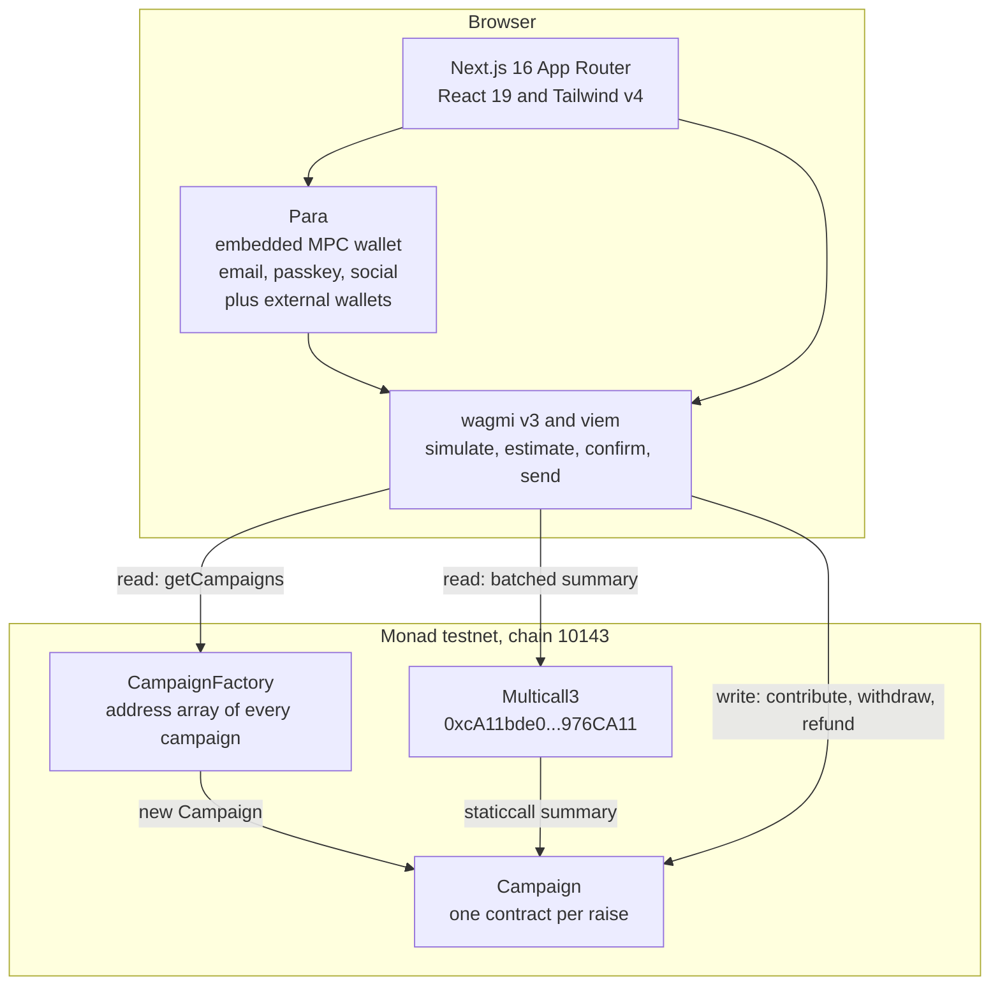
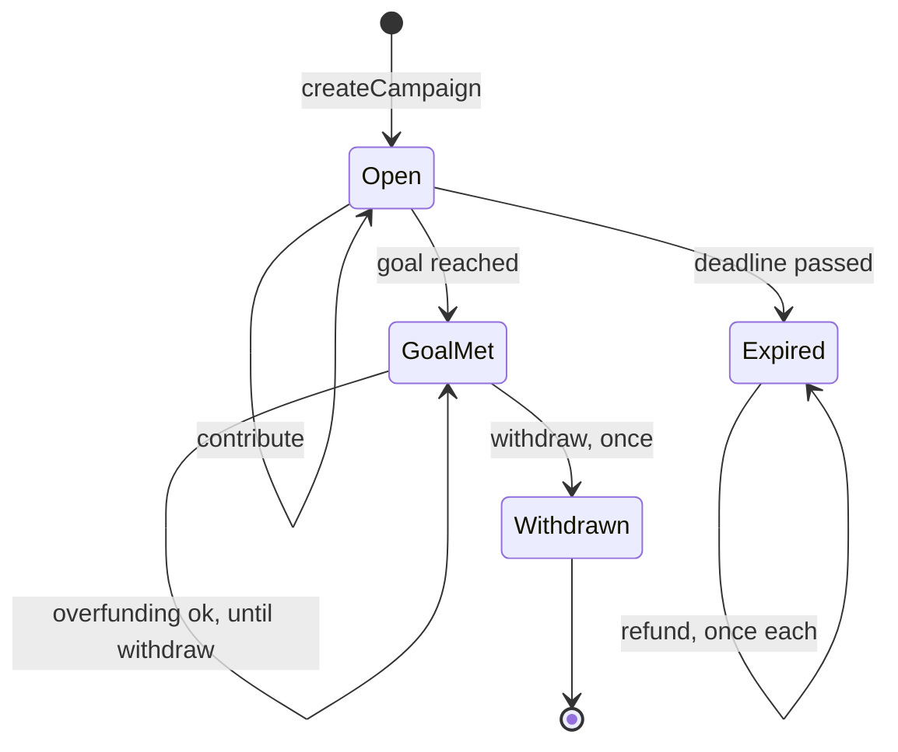
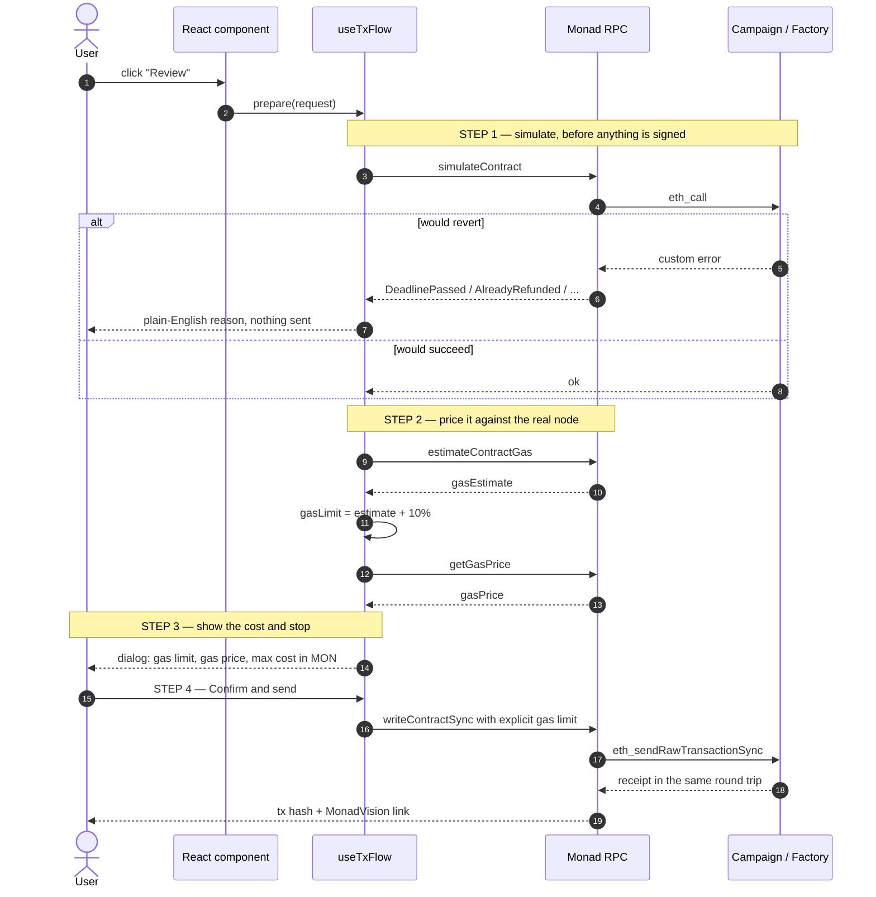
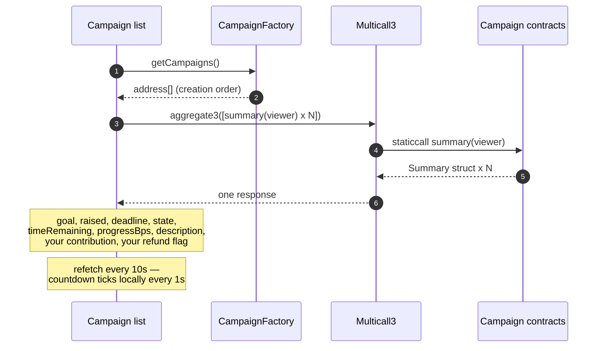
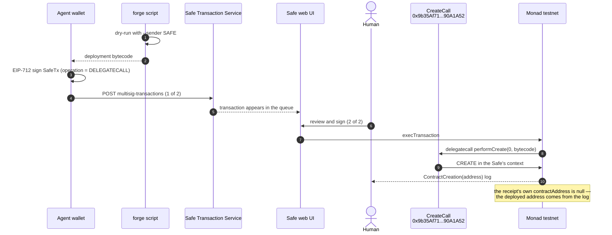

<div align="center">

# MonFund

**All-or-nothing crowdfunding in native MON, on Monad testnet.**

Create a campaign with a goal and a deadline. Anyone can contribute MON.
Hit the goal and the creator withdraws; miss it and every contributor pulls their own money back.

[-836EF9)](https://testnet.monadvision.com)
[](contracts/src)
[](contracts/test)
[](web)
[](LICENSE)

> **Testnet only. Not audited. Do not use with real funds.**

</div>

---

## Live deployment

Both contracts go to Monad testnet through a **2-of-2 Safe multisig** and are verified on both
explorers — nothing reaches the chain without a human co-signature.

> **Every address, transaction hash and digest below is a placeholder.** No live instance is
> published here; fill each `<TOKEN>` in with the values your own [Redeploying](#redeploying) run
> prints. The same tokens are used in `deploy/multisig.example.json`, which is the template for
> recording them.

| Contract | Address | Verification |
|---|---|---|
| `CampaignFactory` | [`<FACTORY_ADDRESS>`](https://testnet.monadvision.com/address/<FACTORY_ADDRESS>) | MonadVision + Monadscan — *perfect match* |
| `Campaign` (first instance) | [`<CAMPAIGN_ADDRESS>`](https://testnet.monadvision.com/address/<CAMPAIGN_ADDRESS>) | MonadVision + Monadscan — *perfect match* |

> ### ⚠️ Any previously deployed factory **predates a known fund-lockup fix**
>
> A factory that was on chain before this tree was built from the pre-fix source. There
> `contribute()` stays open after the creator calls `withdraw()`, so MON that lands between the
> withdrawal and the deadline can be neither withdrawn (one-shot) nor refunded (the goal was met)
> — it is stranded permanently. `contracts/src/Campaign.sol` in this tree rejects that
> contribution with `AlreadyWithdrawn`, caps the deadline at `MAX_DURATION`, and adds
> `withdrawTo()` so a creator that cannot receive MON is not a second lockup.
>
> **Shipping the fixed contracts needs a new deployment through the 2-of-2 Safe** (see
> [Redeploying](#redeploying)) — it cannot be done from a checkout alone. Any pre-fix instance
> still running is the old code; the record below is provenance, not a statement about this source.

| Role | Address |
|---|---|
| Safe multisig (deployer, 2-of-2) | [`<SAFE_ADDRESS>`](https://app.safe.global/home?safe=monad-testnet:<SAFE_ADDRESS>) |
| Agent wallet (Safe owner, proposer) | `<SAFE_OWNER_1>` |
| Human wallet (Safe owner, executor) | `<SAFE_OWNER_2>` |

<details>
<summary>Deployment transactions</summary>

| Safe nonce | Action | Transaction |
|---|---|---|
| — | Deploy the Safe itself (direct from the agent wallet) | [`<TX_SAFE_DEPLOY>`](https://testnet.monadvision.com/tx/<TX_SAFE_DEPLOY>) |
| `0` | Deploy `CampaignFactory` via CreateCall delegatecall | [`<TX_FACTORY_DEPLOY>`](https://testnet.monadvision.com/tx/<TX_FACTORY_DEPLOY>) |
| `1` | `createCampaign(0.05 MON, +7d, "MonFund demo …")` | [`<TX_CREATE_CAMPAIGN>`](https://testnet.monadvision.com/tx/<TX_CREATE_CAMPAIGN>) |

Hash the deployed runtime bytecode and compare it byte-for-byte against the local Foundry
artifact before submitting verification — `make-verify-payload.mjs` does exactly that and refuses
on a mismatch. Record the result in
[`deploy/multisig.example.json`](deploy/multisig.example.json).

</details>

---

## The rules

Four rules, all enforced in the contract — the UI is a convenience, never the guard.

| # | Rule |
|---|---|
| 1 | Contributions are accepted **only before** the deadline, and **only until** the creator withdraws. |
| 2 | The creator can withdraw **only if** `totalRaised >= goal`, and **only once**. |
| 3 | A contributor can reclaim **only if** the deadline passed **and** the goal was missed, **only their own** contribution, and **only once**. |
| 4 | Funds are **pulled, never pushed** — nobody receives MON without calling for it themselves. |

**What rule 2 costs you.** Once the goal is met the raise has succeeded, so refunds close
permanently — `refund()` reverts `GoalWasMet` with no time component. `creator` is immutable, so
if the creator loses their key or simply never signs, the MON stays in the campaign forever. There
is no admin and no timeout; that is the price of having no privileged role. Contributing past the
goal line is a bet on the creator, not on the contract. The one lockup that *is* escapable is a
creator that cannot receive MON: `withdrawTo(address)` lets the creator name a different payout
address, so a contract creator with no payable `receive` does not strand the raise.

---

## Architecture



**No indexer, no backend, no database.** The factory keeps every campaign address in an
onchain array, so the frontend lists campaigns with one `eth_call` plus one Multicall3 batch.

---

## Campaign lifecycle

`state()` is *derived* on every call — it is never stored, so it can never drift out of sync
with the balance or the clock.



Two asymmetries worth internalising:

- **`GoalMet` is absorbing with respect to the clock.** Once the goal is met the raise has
  succeeded; the deadline passing afterwards does *not* re-open refunds. The creator can withdraw
  whenever they like — including before the deadline, which is why `contribute()` also closes on
  `withdrawn` and not only on the clock. Overfunding is allowed until whichever comes first.
- **`Expired` has exactly one exit, and it is per-wallet.** `contribute()` and `withdraw()` both
  revert there. `refund()` is the only way funds leave, and each wallet takes only its own.

The UI adds one **viewer-scoped** state on top of these four: **Refunded** — "this campaign
expired unfunded and *you* already pulled your money out". It is per-wallet, not per-campaign.

| Badge | Condition | What the viewer can do |
|---|---|---|
| 🔵 **Open** | before deadline, `raised < goal` | contribute |
| 🟢 **Goal met** | `raised >= goal`, not withdrawn | creator: withdraw · others: contribute if before deadline |
| 🟠 **Expired** | after deadline, `raised < goal` | contributors: refund |
| 🟣 **Withdrawn** | creator took the funds | nothing — terminal, and `contribute()` is closed too |
| ⚪ **Refunded** | expired + *this wallet* already refunded | nothing |

---

## How a write actually happens

Every state-changing call in the app goes through the same four gates. Nothing is broadcast
without an explicit click on a dialog that already shows the simulated outcome and the exact
gas cost.



Why the explicit gas limit matters on Monad specifically: **Monad charges on the gas limit,
not on gas used.** A wallet that falls back to a large default limit costs the user real MON.
The app estimates against the node, adds at most a 10% buffer, and pins that limit on the
transaction itself.

---

## Listing without an indexer



`Campaign.summary(address)` returns everything a card needs in a single struct, so the list
costs **two round trips total** regardless of how many campaigns exist.

---

## Deployment through the Safe multisig

The agent wallet can sign, but it cannot move value alone. Every deployment is proposed to a
2-of-2 Safe and executed by a human. Safe contracts cannot `CREATE` from a plain call, so the
deployment delegatecalls into Safe's `CreateCall` helper and the Safe itself becomes the deployer.



Verification is then a single call to the MONSKILLS verify API, which fans out to MonadVision and
Monadscan at once. See [`scripts/make-verify-payload.mjs`](scripts/make-verify-payload.mjs).

---

## Quick start

### Prerequisites

- Node.js 20.9+ (and below 23 — see `engines` in `web/package.json`, `.nvmrc` pins 22)
- [Foundry](https://getfoundry.sh) (only if you want to build or test the contracts)
- A wallet on Monad testnet — RPC `https://testnet-rpc.monad.xyz`, chain id `10143`, symbol `MON`
- Testnet MON from a [faucet](https://faucet.monad.xyz)

### Run the frontend

```bash
git clone https://github.com/rahmanef63/monfund.git
cd monfund/web

cp .env.example .env.local          # then paste your factory address into it
npm ci                              # or `npm install`
npm run dev
```

Open <http://localhost:3000>. With no factory address configured the app renders a
misconfiguration banner and lists nothing — deploy one first ([Redeploying](#redeploying)).

`npm ci` reports 17 low-severity advisories, all of them the same root cause: `elliptic`, pulled in
transitively by the Para SDK. Version 6.6.1 is the newest ever published and the advisory range is
`<=6.6.1`, so there is nothing to upgrade or override to. Nothing else is outstanding.

### Environment

| Variable | Required | Notes |
|---|---|---|
| `NEXT_PUBLIC_FACTORY_ADDRESS` | yes | `<FACTORY_ADDRESS>` — unset or malformed shows the misconfiguration banner |
| `NEXT_PUBLIC_MONAD_TESTNET_RPC` | no | defaults to `https://testnet-rpc.monad.xyz` |
| `NEXT_PUBLIC_PARA_API_KEY` | no | see below |

**Para.** The app ships with [Para](https://getpara.com) wired in — embedded MPC wallets with
email, phone, passkey and social login, plus external-wallet connect. The public API key can only
be minted by the project owner:

```bash
npm install -g @getpara/cli
para login                                         # browser OAuth — only a human can do this
para keys create -n monfund-dev --display-name "MonFund (dev)"
```

Leave the key empty and the app falls back to a plain injected connector (MetaMask) so the demo
still runs — a banner tells you which mode you are in.

> `web/package.json` installs Para through an npm alias:
> `"@getpara/react-sdk": "npm:@getpara/react-sdk-lite@^3.11.0"`. The lite build is EVM-only — it
> drops the Cosmos / Solana / Sui / Stellar / account-abstraction subtrees the full SDK pulls in,
> which is ~1,500 fewer packages and no native install scripts. Import specifiers in `web/src` are
> unchanged, so `providers.tsx` reads as if it were on the full SDK. *TODO: import
> `@getpara/react-sdk-lite` directly and drop the alias.*

### Build and test the contracts

Every target lives in [`contracts/Makefile`](contracts/Makefile) and must be run from `contracts/`
(a bare `forge install` from the repo root would populate `<root>/lib`, which the remappings do
not point at).

```bash
cd contracts
make install     # pins forge-std v1.16.2 + openzeppelin-contracts v5.4.0
make build       # forge build
make test        # 62 tests
make gas         # gas report
make clean       # forge clean
```

> `contracts/lib/` is gitignored, so a clean clone has no dependencies at all — `make install` is
> the first thing to run. It uses forge's `@tag=` form, which forces an exact tag match rather
> than falling back to a branch or rev of the same name; those two tags at the top of the Makefile
> *are* the pin. `--no-git` is passed deliberately: without it `forge install` registers each dep
> as a git submodule and leaves every clean clone with a dirty index. Bumping either pin changes
> the bytecode.

### Reproducible build

Two clean clones produce the same artifacts: the compiler version is exact (`pragma solidity
0.8.28;` in every file, matching `foundry.toml`), `evm_version` is pinned, and both dependencies
are pinned to exact tags by `make install`.

What this does **not** claim: this tree does not reproduce the runtime bytecode of any pre-fix factory
(see the warning at the top) — the source has changed since. Derive the digest from your own build
rather than trusting a quoted one:

```bash
cd contracts && make install && forge build --force
node -e "const c=require('./out/CampaignFactory.sol/CampaignFactory.json').deployedBytecode.object.toLowerCase();
         console.log(require('crypto').createHash('sha256').update(c).digest('hex'))"
# <RUNTIME_SHA256>
```

The same digest against a live contract, once the fixed factory has been deployed through the Safe:

```bash
cast code <FACTORY_ADDRESS> --rpc-url https://testnet-rpc.monad.xyz \
  | tr -d '\n' | sha256sum
```

### Pre-push checks

Nothing else in the repo runs a check, so [`.githooks/pre-push`](.githooks/pre-push) is the gate.
Git does not clone hooks — enable it once per checkout:

```bash
git config core.hooksPath .githooks
```

It runs three gates — `forge test --root contracts`, then `npm --prefix web run typecheck` and
`npm --prefix web run lint` (the last two only once `web/node_modules` exists) — and aborts the
push if any fails. `lint` is the only gate that covers `scripts/` and `tools/`; `tsc` never looks
at them. `git push --no-verify` bypasses everything.

---

## Contracts

### `Campaign.sol`

One campaign. Denominated in native MON. No `receive()` or `fallback()`, so MON can only enter
through `contribute()`.

| Function | Guard |
|---|---|
| `contribute()` `payable` | `!withdrawn`, `block.timestamp < deadline`, `msg.value > 0` |
| `withdraw()` | one-line wrapper for `withdrawTo(creator)` — same guards, no second implementation |
| `withdrawTo(address payable to)` | `msg.sender == creator`, `to != address(0)`, `totalRaised >= goal`, `!withdrawn` |
| `refund()` | `block.timestamp >= deadline`, `totalRaised < goal`, `contributions[msg.sender] > 0`, `!refunded[msg.sender]` |
| `state()` `view` | derived — `Open` / `GoalMet` / `Withdrawn` / `Expired` |
| `timeRemaining()` `view` | seconds left, floors at 0 |
| `progressBps()` `view` | basis points toward the goal, uncapped |
| `summary(address)` `view` | everything the UI needs, one struct |

**Storage layout and why:**

| Slot kind | Field | Reason |
|---|---|---|
| `constant` | `MAX_DESCRIPTION_BYTES` = 280, `MAX_DURATION` = 365 days | constructor bounds; no slot, inlined at compile time |
| `immutable` | `creator`, `goal`, `deadline` | no `SLOAD` on the hot path — cold storage reads cost **8,100** gas on Monad vs 2,100 on Ethereum |
| storage | `totalRaised` | running total; final once the deadline passes |
| storage | `withdrawn` | set **before** the transfer, so a second withdrawal can never pass the check |
| mapping | `contributions[addr]` | per-contributor balance, zeroed before the refund transfer |
| mapping | `refunded[addr]` | second, independent guard against double refunds |

Every value-moving path carries OpenZeppelin's `ReentrancyGuard` **and** follows
checks-effects-interactions, so the guard is a backstop rather than the only defence. (`withdraw()`
is not itself `nonReentrant` — it takes the guard through `withdrawTo`, and taking a non-reentrant
guard twice in one call would revert.) Failed MON transfers revert with `TransferFailed` instead of
being silently swallowed.

**Why `withdrawTo` exists.** `creator` is immutable, so a contract creator with no payable
`receive` would fail `withdraw()` with `TransferFailed` forever while refunds stayed closed
(`totalRaised >= goal`) — every contributor's MON locked permanently. `withdrawTo` is the escape
hatch, and it grants an EOA creator no new power: whoever holds that key can already move the funds
anywhere the moment `withdraw()` lands. It is still one-shot, still creator-only, and it rejects
`address(0)` with `InvalidRecipient` (a zero-address `call` succeeds, so without that guard the
raise would burn). `Withdrawn(address indexed creator, uint256 amount, address indexed recipient)`
names both, so the log never claims the creator received funds that went elsewhere.

### `CampaignFactory.sol`

```solidity
address[] public campaigns;                       // every campaign, creation order
mapping(address => bool) public isCampaign;       // provenance check for the UI

function createCampaign(uint256 goal, uint256 deadline, string calldata description)
    external returns (address campaign);
function campaignsCount() external view returns (uint256);
function getCampaigns() external view returns (address[] memory);
function getCampaigns(uint256 offset, uint256 limit) external view returns (address[] memory);
```

The factory **holds no funds** and has **no owner, admin or moderation role**. Argument
validation lives in the `Campaign` constructor so there is one source of truth. The detail page
calls `isCampaign()` and warns if an address did not come from this factory.

### Custom errors

`Campaign` (17): `InvalidCreator` · `InvalidRecipient` · `InvalidGoal` · `DeadlineInPast` ·
`DeadlineTooFar` · `DescriptionEmpty` · `DescriptionTooLong` · `DeadlinePassed` ·
`ZeroContribution` · `NotCreator` · `GoalNotMet` · `AlreadyWithdrawn` · `DeadlineNotPassed` ·
`GoalWasMet` · `NothingToRefund` · `AlreadyRefunded` · `TransferFailed`

`CampaignFactory` (1): `BadRange`

17 of the 18 are mapped to a plain-English sentence in the UI (`FRIENDLY` in
[`web/src/lib/useTxFlow.ts`](web/src/lib/useTxFlow.ts)) and surfaced at *simulation* time, before
the user pays for anything. `InvalidRecipient` is the exception, because the UI never calls
`withdrawTo()`. Anything unmapped falls back to `Reverted: <ErrorName>`, or to viem's raw message
if the ABI cannot name it.

`DeadlineTooFar` is additionally unreachable from the create form, which caps its datetime picker
at `MAX_DURATION` and re-checks the bound before simulating — the contract remains the enforcing
authority, the form just avoids spending a round trip to learn what it already knows.

---

## Tests

```bash
cd contracts && make test
```

**62 passing** across three suites — 50 `CampaignTest`, 10 `CampaignFactoryTest`, 2
`CampaignInvariantTest` — including every adversarial case the design calls for:

| Scenario | Test |
|---|---|
| Double withdrawal | `test_RevertWhen_WithdrawTwice` |
| Double withdrawal mixing both entry points, in either order | `test_RevertWhen_SecondWithdrawalThroughEitherEntryPoint` |
| Double refund | `test_RevertWhen_RefundTwice` |
| Contribution *exactly at* the deadline, and after | `test_RevertWhen_ContributeAfterDeadline` |
| Refund before the deadline — and that it opens *exactly at* it | `test_RevertWhen_RefundBeforeDeadline` |
| Contribution after the creator withdrew | `test_RevertWhen_ContributeAfterWithdrawal` |
| Refund after the creator withdrew | `test_RevertWhen_RefundAfterWithdrawal` |
| Deadline more than `MAX_DURATION` out, and exactly at it | `test_RevertWhen_DeadlineTooFar`, `test_CreateCampaign_DeadlineAtExactlyMaxDuration` |
| Goal met exactly on the final wei | `test_GoalMetExactlyAtLastContribution` |
| Goal met on the final wei at `deadline - 1` | `test_GoalMetExactlyAtDeadlineMinusOne` |
| Reentrancy into `withdraw()` from the creator's `receive()` | `test_Reentrancy_WithdrawIsBlocked` |
| Reentrancy into `refund()` from a contributor's `receive()` | `test_Reentrancy_RefundIsBlocked` |
| Cross-function reentrancy `withdraw()` → `contribute()` | `test_Reentrancy_WithdrawIntoContributeIsBlocked` |
| Withdraw by a non-creator | `test_RevertWhen_WithdrawByNonCreator` |
| Withdraw below the goal, before and after the deadline | `test_RevertWhen_WithdrawGoalNotMet` |
| Withdraw sweeps force-fed balance, not just `totalRaised` | `test_Withdraw_SweepsForceFedBalance` |
| `withdrawTo` pays the named recipient and nobody else | `test_WithdrawTo_PaysNamedRecipient` |
| `withdrawTo` by a non-creator, below the goal, or to `address(0)` | `test_RevertWhen_WithdrawToByNonCreator`, `test_RevertWhen_WithdrawToGoalNotMet`, `test_RevertWhen_WithdrawToZeroAddress` |
| A creator that can never receive MON still gets the funds out | `test_WithdrawTo_EscapesCreatorThatCannotReceive` |
| A reverting recipient rolls back without consuming the one shot | `test_WithdrawTo_SurfacesFailedTransferAndKeepsTheShot` |
| Zero creator address, constructed directly rather than via the factory | `test_RevertWhen_CreatorIsZero` |
| Refund after the goal was met | `test_RevertWhen_RefundAfterGoalMet` |
| Bare MON transfer to a campaign | `test_RevertWhen_PlainTransferToCampaign` |
| Transfer failure surfaces instead of being swallowed | `test_Withdraw_SurfacesFailedTransfer`, `test_Refund_SurfacesFailedTransfer` |
| `summary()` in every lifecycle state, including `summary(address(0))` | `test_Summary_AcrossLifecycleStates` |
| Pagination range errors and a `type(uint256).max` limit | `test_RevertWhen_PaginationOffsetPastEnd`, `test_GetCampaigns_LargeLimitDoesNotOverflow` |
| Refunds always return exactly what was contributed | `testFuzz_RefundReturnsExactlyWhatWasContributed` |
| Never withdrawable below the goal | `testFuzz_NoWithdrawBelowGoal` |
| Fuzzed goal *and* deadline, funded past the line, withdrawn once | `testFuzz_GoalMetThenWithdraw` |
| Payouts never exceed contributions | `invariant_PayoutsNeverExceedContributions` |
| Balance always equals contributed minus paid out | `invariant_BalanceEqualsContributedMinusPaidOut` |

The reentrancy tests use real attacker contracts in
[`contracts/test/helpers/Attackers.sol`](contracts/test/helpers/Attackers.sol) that re-enter from
`receive()`, record the revert **selector**, and assert it is OpenZeppelin's
`ReentrancyGuardReentrantCall` — so a passing test proves the guard fired, not merely that
something reverted.

`CampaignInvariantTest` drives a three-actor handler (contribute / refund / withdraw / warp)
through 256 runs × 500 calls per invariant, double-entry booking every wei that actually moves.

---

## Gas

Measured with Ethereum pricing. Monad prices cold state access and precompiles higher, so treat
these as a floor and always trust a live `eth_estimateGas`.

```bash
cd contracts && forge test --gas-report --no-match-contract CampaignInvariantTest
```

The exclusion matters: the invariant handler makes 128,000 calls against a single warm campaign,
which drags the medians far below anything a real user pays. `make gas` runs the unfiltered
report.

| Function | Median | Max |
|---|---|---|
| `createCampaign` | 900,711 | 939,848 |
| `contribute` | 71,994 | 71,994 |
| `withdraw` | 30,712 | 56,931 |
| `withdrawTo` | 45,611 | 61,079 |
| `refund` | 56,873 | 56,873 |

Runtime sizes from `forge build --sizes`: `CampaignFactory` 6,273 bytes · `Campaign` 3,730 bytes.

**Monad differences the app accounts for:**

| | Ethereum | Monad |
|---|---|---|
| Charged on | gas used | **gas limit** |
| Cold account access | 2,600 | 10,100 |
| Cold storage access | 2,100 | 8,100 |
| Minimum base fee | — | 100 MON-gwei |

---

## Project structure

```
monfund/
├── contracts/                     Foundry project
│   ├── src/Campaign.sol           one campaign: goal, deadline, contributions, refunds
│   ├── src/CampaignFactory.sol    deploys campaigns, keeps the onchain address array
│   ├── script/Deploy.s.sol        simulation-only deploy for the Safe flow
│   ├── test/                      62 tests: units, fuzz, invariants, attacker contracts
│   └── Makefile                   install / build / test / gas / dry-run / clean
├── web/                           Next.js 16 + wagmi v3 + viem + Para
│   ├── .env.example               the three NEXT_PUBLIC_* keys, all blank or defaulted
│   └── src/
│       ├── app/                   layout, providers, list page, /campaign/[address]
│       ├── components/            cards, progress bar, countdown, confirm dialog, actions
│       └── lib/                   ABIs, chain config, useTxFlow, useCampaigns
├── .githooks/pre-push             forge test + web typecheck + lint (opt in, see above)
├── eslint.config.mjs              root config — the only way to lint scripts/ and tools/
├── scripts/
│   ├── gen-abis.mjs               regenerate web ABIs from Foundry artifacts
│   └── make-verify-payload.mjs    build the explorer-verification request offline
├── deploy/
│   └── multisig.example.json      template for recording your Safe, owners, threshold, deployments
├── tools/relay/                   browser-relay transport (see below)
├── DEMO.md                        step-by-step demo walkthrough
└── .monskills                     built-with=monskills, chain=monad-testnet
```

After changing a contract, regenerate the frontend ABIs:

```bash
cd contracts && forge build
cd ../web && npm run gen:abi
```

---

## Redeploying

This needs a keystore for one Safe owner *and* a second owner to co-sign. It is also the only way
to ship the current source — any factory already on chain is pre-fix (see the warning at the top).
`<SAFE_ADDRESS>` below is your own Safe; the steps print the rest of the placeholder values.

> **The keystore handling below is deliberately blunt and is not safe to copy elsewhere.**
> `--unsafe-password ""` assumes an empty-passphrase keystore, the decrypted private key is
> `awk`'d off stdout into a shell environment (so it lands in the process table and, depending on
> your shell, in history), and `ls … | head -1` picks whichever keystore sorts first rather than
> the one you meant. Check `ls ~/.monskills/keystore` and name the file explicitly if you have
> more than one.

```bash
cd contracts

# 1. Simulate from the Safe — no broadcast, produces the deployment bytecode
make dry-run SAFE_ADDRESS=<SAFE_ADDRESS>

# 2. Propose it to the Safe. SCRIPT_DIR is the MONSKILLS wallet/utils folder —
#    the one containing propose.sh and propose.mjs.
SCRIPT_DIR=~/.agents/skills/wallet/utils
KEYSTORE_FILENAME=$(ls ~/.monskills/keystore | head -1)
CHAIN_ID=10143 \
  SAFE_ADDRESS=<SAFE_ADDRESS> \
  PRIVATE_KEY=$(cast wallet decrypt-keystore --keystore-dir ~/.monskills/keystore \
                  $KEYSTORE_FILENAME --unsafe-password "" | awk '{print $NF}') \
  DEPLOYMENT_BYTECODE=$(jq -r '.transactions[0].transaction.input' \
                  broadcast/Deploy.s.sol/10143/dry-run/run-latest.json) \
  bash "$SCRIPT_DIR/propose.sh"

# 3. Approve + execute in the Safe UI, then read the address from the CreateCall log
#    (the receipt's own contractAddress is always null for Safe deployments).
#    ContractCreation(address indexed) — the address is in topics[1], data is empty.
#    Filter on topics[0], NOT on log.address: CreateCall is delegatecalled, so the log
#    is emitted under the Safe's own address.
cast receipt <TX_FACTORY_DEPLOY> --rpc-url https://testnet-rpc.monad.xyz --json \
  | jq -r '.logs[] | select(.topics[0] ==
      "0x4db17dd5e4732fb6da34a148104a592783ca119a1e7bb8829eba6cbadef0b511")
      | .topics[1]' | sed 's/0x000000000000000000000000/0x/'

# 4. Verify on both explorers with one call. `build_info = true` is set in
#    foundry.toml, so a plain `forge build` already writes the full build-info
#    the payload is assembled from.
forge build
node ../scripts/make-verify-payload.mjs CampaignFactory <FACTORY_ADDRESS> /tmp/verify.json
curl -X POST https://agents.devnads.com/v1/verify \
  -H "Content-Type: application/json" -d @/tmp/verify.json
```

Omit the third argument and the script writes to a fresh `mktemp -d` directory (mode `0700`, file
`0600`) and prints the path — read it from the `wrote …` line rather than guessing.

`make-verify-payload.mjs` calls `eth_getCode` on the address and refuses to write the payload if the
local `deployedBytecode` disagrees with what is on chain — that is the check that would have
caught this repo shipping a stale byte-identity claim. Two env vars:

| Variable | Effect |
|---|---|
| `MONAD_TESTNET_RPC` | overrides the default `https://testnet-rpc.monad.xyz` |
| `VERIFY_SKIP_ONCHAIN_CHECK=1` | skips the comparison entirely — needed on a no-egress/relay machine, and a deliberate downgrade of what verification proves |

Then update `NEXT_PUBLIC_FACTORY_ADDRESS` in `web/.env.local` and restart the dev server.

---

## Scope

Deliberately **not** included, to keep the surface honest and auditable:

- ❌ ERC-20 or any asset other than native MON
- ❌ Campaign categories, tags or search
- ❌ Admin, owner or moderation roles — the factory has none
- ❌ Indexer, subgraph or backend of any kind
- ❌ Analytics or tracking
- ❌ Mainnet

---

## A note on how this was built

This project was built end to end with [MONSKILLS](https://skills.devnads.com) — the
`scaffold`, `wallet`, `wallet-integration`, `gas`, `concepts` and `addresses` skills.

The build ran in a sandbox whose network allowlist blocked `testnet-rpc.monad.xyz`,
`api.safe.global` and `agents.devnads.com`. Rather than reimplement the Safe proposal flow —
which the MONSKILLS `wallet/` skill explicitly forbids — MONSKILLS' own `propose.mjs` was run
**completely unmodified** with only its network transport swapped:
[`tools/relay/relay-fetch.mjs`](tools/relay/relay-fetch.mjs) overrides `globalThis.fetch`, writes
each request to a file, and the response is fetched through a browser on a networked machine and
written back. Every payload was gzipped, base64-encoded and SHA-256 checked on both ends before
being sent, so nothing was retyped by hand.

You do not need any of this. On a normal machine the commands above just work — the relay is kept
in the repo only so the deployment is fully reproducible and auditable.

---

## License

[MIT](LICENSE) © rahmanef63

**Testnet software. Not audited. Not for real funds.**
